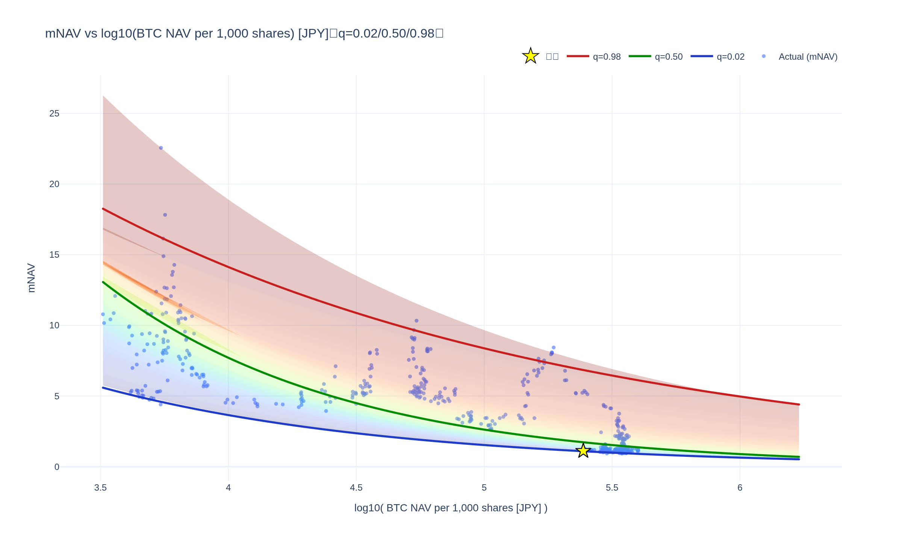
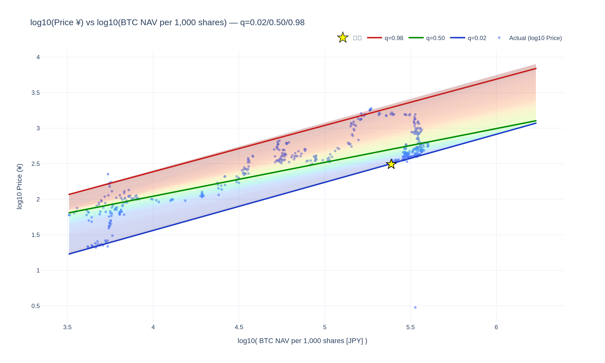
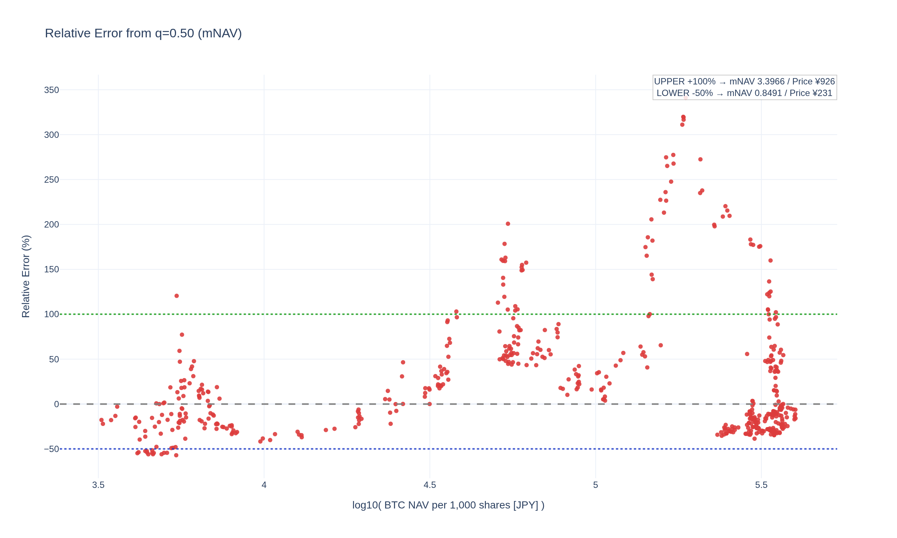

# meta-analysis

<!--REPORT:START-->
**Last update (JST):** 2025-10-21 14:18 (UTC+09:00)

### Summary
・Bitcoin価格: $107,730（¥16,290,000）  
・株価: ¥422（mNAV=1: ¥431）

### Signals
・RSI(週足,14)（暫定）: 14.5  
・乖離率 (mNAV vs q=0.50): -63%  
・Signal: 🟣 強買い  
｜買いライン(q=0.05/0.03/0.02): ¥518 / ¥497 / ¥442  
｜売りライン(q=0.95/0.97/0.98): ¥2,747 / ¥2,839 / ¥3,009

| Method                 | 0.01   | 0.02   | 0.03   | 0.05   | 0.10   | 0.20   | 0.30   | 0.40   | 0.50   | 0.60   | 0.70   | 0.80   | 0.90   | 0.95   | 0.97   | 0.98   | 0.99   |
|:-----------------------|:-------|:-------|:-------|:-------|:-------|:-------|:-------|:-------|:-------|:-------|:-------|:-------|:-------|:-------|:-------|:-------|:-------|
| mNAV Regression        | ¥408   | ¥442   | ¥497   | ¥518   | ¥572   | ¥645   | ¥845   | ¥923   | ¥1,082 | ¥1,271 | ¥1,393 | ¥1,778 | ¥2,395 | ¥2,747 | ¥2,839 | ¥3,009 | ¥3,015 |
| Stock-Price Regression | ¥408   | ¥441   | ¥495   | ¥516   | ¥573   | ¥637   | ¥820   | ¥873   | ¥965   | ¥1,128 | ¥1,300 | ¥1,741 | ¥2,246 | ¥2,450 | ¥2,501 | ¥2,750 | ¥2,764 |

### Charts
[Open interactive Chart 1: mNAV vs log10(NAV/1000) [JPY]](https://tkzm240.github.io/meta-analysis/fig1.html)

[Open interactive Chart 2: log10(Price) vs log10(NAV/1000) [JPY]](https://tkzm240.github.io/meta-analysis/fig2.html)

[Open interactive Chart 3: Relative Error from q=0.50 (mNAV)](https://tkzm240.github.io/meta-analysis/fig3.html)

[Open interactive Chart 4: Relative Error from q=0.50 (Price)](https://tkzm240.github.io/meta-analysis/fig4.html)

<!--REPORT:END-->
