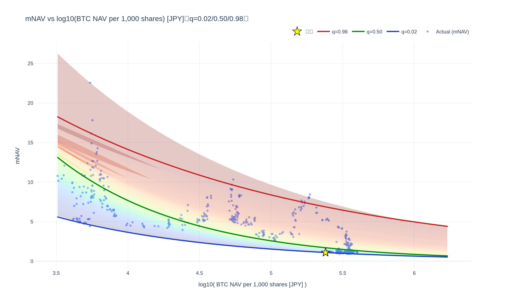
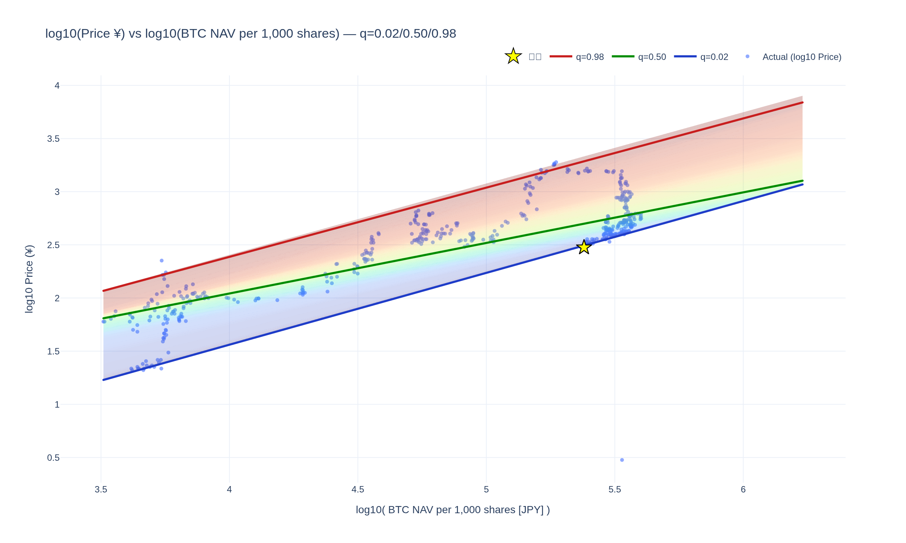
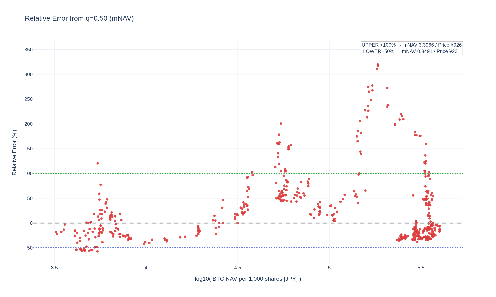
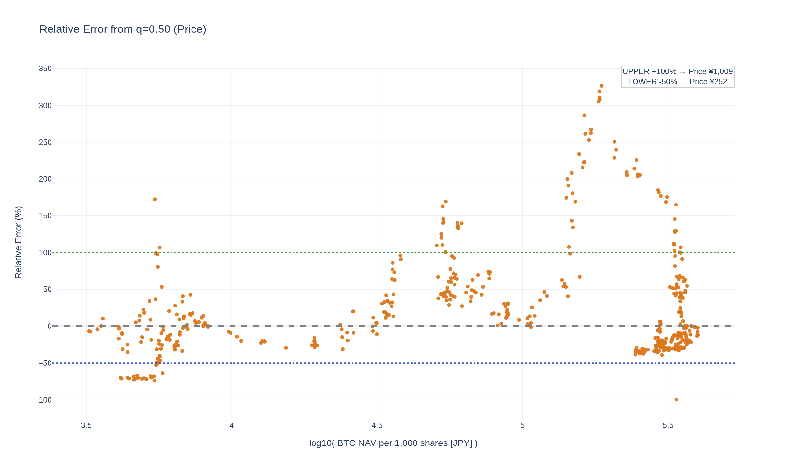

# meta-analysis

<!--REPORT:START-->
**Last update (JST):** 2026-03-12 12:32 (UTC+09:00)

### Summary
・Bitcoin価格: $75（¥10,190,000）  
・株価: ¥299（mNAV=1: ¥272）

### Signals
・RSI(週足,14)（暫定）: 41.5  
・乖離率 (mNAV vs q=0.50): -35%  
・Signal: 🔵 買い  
｜買いライン(q=0.05/0.03/0.02): ¥305 / ¥304 / ¥299  
｜売りライン(q=0.95/0.97/0.98): ¥1,613 / ¥1,790 / ¥1,871

| Method                 | 0.01   | 0.02   | 0.03   | 0.05   | 0.10   | 0.20   | 0.30   | 0.40   | 0.50   | 0.60   | 0.70   | 0.80   | 0.90   | 0.95   | 0.97   | 0.98   | 0.99   |
|:-----------------------|:-------|:-------|:-------|:-------|:-------|:-------|:-------|:-------|:-------|:-------|:-------|:-------|:-------|:-------|:-------|:-------|:-------|
| mNAV Regression        | ¥296   | ¥299   | ¥304   | ¥305   | ¥319   | ¥344   | ¥385   | ¥413   | ¥463   | ¥623   | ¥729   | ¥908   | ¥1,368 | ¥1,613 | ¥1,790 | ¥1,871 | ¥2,057 |
| Stock-Price Regression | ¥306   | ¥312   | ¥312   | ¥316   | ¥327   | ¥361   | ¥398   | ¥445   | ¥500   | ¥655   | ¥765   | ¥956   | ¥1,427 | ¥1,689 | ¥1,785 | ¥1,931 | ¥2,147 |

### Charts
[Open interactive Chart 1: mNAV vs log10(NAV/1000) [JPY]](https://tkzm240.github.io/meta-analysis/fig1.html)

[Open interactive Chart 2: log10(Price) vs log10(NAV/1000) [JPY]](https://tkzm240.github.io/meta-analysis/fig2.html)

[Open interactive Chart 3: Relative Error from q=0.50 (mNAV)](https://tkzm240.github.io/meta-analysis/fig3.html)

[Open interactive Chart 4: Relative Error from q=0.50 (Price)](https://tkzm240.github.io/meta-analysis/fig4.html)

<!--REPORT:END-->
