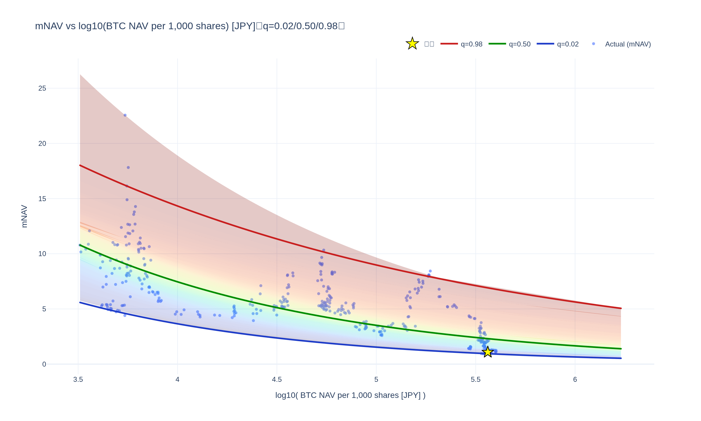

# meta-analysis

<!--REPORT:START-->
**Last update (JST):** 2026-01-27 12:05 (UTC+09:00)

### Summary
・Bitcoin価格: $88,662（¥13,680,000）  
・株価: ¥493（mNAV=1: ¥385）

### Signals
・RSI(週足,14)（暫定）: 52.0  
・乖離率 (mNAV vs q=0.50): -28%  
・Signal: 🟢 中立  
｜買いライン(q=0.05/0.03/0.02): ¥384 / ¥382 / ¥378  
｜売りライン(q=0.95/0.97/0.98): ¥2,173 / ¥2,368 / ¥2,509

| Method                 | 0.01   | 0.02   | 0.03   | 0.05   | 0.10   | 0.20   | 0.30   | 0.40   | 0.50   | 0.60   | 0.70   | 0.80   | 0.90   | 0.95   | 0.97   | 0.98   | 0.99   |
|:-----------------------|:-------|:-------|:-------|:-------|:-------|:-------|:-------|:-------|:-------|:-------|:-------|:-------|:-------|:-------|:-------|:-------|:-------|
| mNAV Regression        | ¥373   | ¥378   | ¥382   | ¥384   | ¥405   | ¥443   | ¥494   | ¥532   | ¥663   | ¥830   | ¥982   | ¥1,240 | ¥1,844 | ¥2,173 | ¥2,368 | ¥2,509 | ¥2,711 |
| Stock-Price Regression | ¥384   | ¥386   | ¥390   | ¥392   | ¥405   | ¥452   | ¥497   | ¥559   | ¥652   | ¥833   | ¥952   | ¥1,214 | ¥1,861 | ¥2,112 | ¥2,177 | ¥2,352 | ¥2,632 |

### Charts
[Open interactive Chart 1: mNAV vs log10(NAV/1000) [JPY]](https://tkzm240.github.io/meta-analysis/fig1.html)

[Open interactive Chart 2: log10(Price) vs log10(NAV/1000) [JPY]](https://tkzm240.github.io/meta-analysis/fig2.html)

[Open interactive Chart 3: Relative Error from q=0.50 (mNAV)](https://tkzm240.github.io/meta-analysis/fig3.html)

[Open interactive Chart 4: Relative Error from q=0.50 (Price)](https://tkzm240.github.io/meta-analysis/fig4.html)

<!--REPORT:END-->
