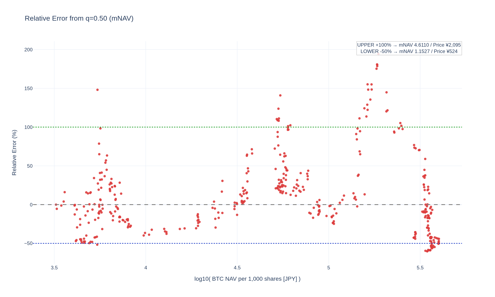

# meta-analysis

<!--REPORT:START-->
**Last update (JST):** 2025-12-04 14:19 (UTC+09:00)

### Summary
・Bitcoin価格: $93,149（¥14,480,000）  
・株価: ¥398（mNAV=1: ¥359）

### Signals
・RSI(週足,14)（暫定）: 25.5  
・乖離率 (mNAV vs q=0.50): -50%  
・Signal: 🟣 強買い 
｜買いライン(q=0.05/0.03/0.02): ¥363 / ¥360 / ¥357  
｜売りライン(q=0.95/0.97/0.98): ¥2,209 / ¥2,336 / ¥2,379

| Method                 | 0.01   | 0.02   | 0.03   | 0.05   | 0.10   | 0.20   | 0.30   | 0.40   | 0.50   | 0.60   | 0.70   | 0.80   | 0.90   | 0.95   | 0.97   | 0.98   | 0.99   |
|:-----------------------|:-------|:-------|:-------|:-------|:-------|:-------|:-------|:-------|:-------|:-------|:-------|:-------|:-------|:-------|:-------|:-------|:-------|
| mNAV Regression        | ¥349   | ¥357   | ¥360   | ¥363   | ¥379   | ¥418   | ¥505   | ¥672   | ¥790   | ¥902   | ¥1,071 | ¥1,309 | ¥1,829 | ¥2,209 | ¥2,336 | ¥2,379 | ¥2,573 |
| Stock-Price Regression | ¥372   | ¥374   | ¥377   | ¥380   | ¥395   | ¥458   | ¥547   | ¥669   | ¥810   | ¥907   | ¥1,050 | ¥1,327 | ¥1,894 | ¥2,140 | ¥2,311 | ¥2,478 | ¥2,574 |

### Charts
[Open interactive Chart 1: mNAV vs log10(NAV/1000) [JPY]](https://tkzm240.github.io/meta-analysis/fig1.html)

[Open interactive Chart 2: log10(Price) vs log10(NAV/1000) [JPY]](https://tkzm240.github.io/meta-analysis/fig2.html)

[Open interactive Chart 3: Relative Error from q=0.50 (mNAV)](https://tkzm240.github.io/meta-analysis/fig3.html)

[Open interactive Chart 4: Relative Error from q=0.50 (Price)](https://tkzm240.github.io/meta-analysis/fig4.html)

<!--REPORT:END-->
