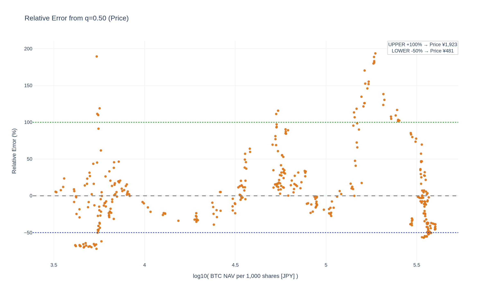

# meta-analysis

<!--REPORT:START-->
**Last update (JST):** 2026-01-14 13:46 (UTC+09:00)

### Summary
・Bitcoin価格: $95,237（¥15,160,000）  
・株価: ¥614（mNAV=1: ¥418）

### Signals
・RSI(週足,14)（暫定）: 54.4  
・乖離率 (mNAV vs q=0.50): -32%  
・Signal: 🟢 中立  
｜買いライン(q=0.05/0.03/0.02): ¥405 / ¥401 / ¥397  
｜売りライン(q=0.95/0.97/0.98): ¥2,328 / ¥2,638 / ¥2,678

| Method                 | 0.01   | 0.02   | 0.03   | 0.05   | 0.10   | 0.20   | 0.30   | 0.40   | 0.50   | 0.60   | 0.70   | 0.80   | 0.90   | 0.95   | 0.97   | 0.98   | 0.99   |
|:-----------------------|:-------|:-------|:-------|:-------|:-------|:-------|:-------|:-------|:-------|:-------|:-------|:-------|:-------|:-------|:-------|:-------|:-------|
| mNAV Regression        | ¥388   | ¥397   | ¥401   | ¥405   | ¥424   | ¥458   | ¥511   | ¥566   | ¥780   | ¥888   | ¥1,090 | ¥1,330 | ¥2,000 | ¥2,328 | ¥2,638 | ¥2,678 | ¥2,892 |
| Stock-Price Regression | ¥403   | ¥406   | ¥410   | ¥413   | ¥426   | ¥462   | ¥506   | ¥584   | ¥716   | ¥883   | ¥1,009 | ¥1,289 | ¥1,998 | ¥2,245 | ¥2,285 | ¥2,499 | ¥2,771 |

### Charts
[Open interactive Chart 1: mNAV vs log10(NAV/1000) [JPY]](https://tkzm240.github.io/meta-analysis/fig1.html)

[Open interactive Chart 2: log10(Price) vs log10(NAV/1000) [JPY]](https://tkzm240.github.io/meta-analysis/fig2.html)

[Open interactive Chart 3: Relative Error from q=0.50 (mNAV)](https://tkzm240.github.io/meta-analysis/fig3.html)

[Open interactive Chart 4: Relative Error from q=0.50 (Price)](https://tkzm240.github.io/meta-analysis/fig4.html)

<!--REPORT:END-->
